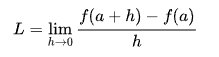

# Седмица 04 - Функции от по-висок ред

## Задача 01 - Основни функции от по-висок ред
Реализирайте ваши версии на следните вградени функции от по-висок ред: `const`, `curry`, `flip`, `(.)`.

## Задача 02 - Комбинирано прилагане
Напишете функция `on`, която приема една двуместна функция `g` и една едноместна функция `f`. Резултатът на функцията да бъде нова двуместна функция `h`, която прилага `f` върху двата аргумента и след това прилага `g` върху двата резултата.

### Пример:
```haskell
ghci> ((+) `on` length) [1, 2, 3] [-1] -- 4
ghci> ((,) `on` (*2)) 2 3 -- (4, 6)
```

## Задача 03 - Многократна композиция
Напишете функция `composeN`, която приема функция `f` и естествено число `n`. Функцията да връща нова функция, която е `n`-кратната композоция на `f`.

### Пример:
```haskell
ghci> composeN (+ 1) 8 $ 4
```

## Задача 04 - Повдигане на булеви функции
Напишете функция `liftB`, която "повдига" функция, приемаща 2 булеви стойности и връщаща булева стойност, до функция приемаща 2 предиката и връщаща предикат. Напишете операторите `(==>)` и `(<=>)`, реализиращи булевите функции за следствие и еквивалентност и с помощта на `liftB` напишете функциите `implies` и `iff`, които реализират същите функции, но за предикати.

### Пример:
```haskell
ghci> implies (> 3) (< 6) 4 -- True
ghci> implies odd (< 6) 4 -- True
ghci> iff odd (< 6) 4 -- False
```

## Задача 05 - Производна
Напишете функция `derive`, която приема функция, и връща нейната производна. Използвайте следната формула, като изберете достатъчно малко h:



### Пример:
```haskell
ghci> derive (^ 2) 4 -- ~8
```

## Задача 06 - Основни функции от по-висок ред за работа със списъци
Реализирайте ваши версии на следните вградени функции от по-висок ред за работа със списъци: `map`, `filter`, `foldr`, `foldl`, `takeWhile`, `dropWhile`, `zipWith`, `any`, `all`, `foldr1`, `foldl1`.

## Задача 07 - Максимум, спрямо критерий
Напишете функция `maximumBy`, която намира максимален елемент в списък спрямо подадена функция за сравнение.

### Пример:
```haskell
ghci> maximumBy ((>) `on` snd) [(4, 1), (5, 2), (0, 4), (2, 0), (3, 3)] -- (0, 4)
```

## Задача 08 - Quick sort
Напишете функция `quickSortBy`, която по подадена функция за сравнение сортира списък чрез алгоритъма `quick sort`.

### Пример:
```haskell
ghci> quickSortBy (\ (a, b) (c, d) -> a + b < c + d) [(1, 7), (2, 3), (4, 9), (5, 2), (8, 5)] -- [(2,3),(5,2),(1,7),(4,9),(8,5)] 
```

## Задача 09 - Групиране
Напишете функция `groupBy`, която приема функция на 1 аргумент `f` и списък. Функцията да групира всички елементи от списъка по стойността, която връща функцията `f` приложена над тях. Резултата да е под формата на списък от наредени двойки, където първата компонента е стойността на `f`, а втората е списък от елементите, които дават тази стойност.

### Пример:
```haskell
ghci> groupBy length [[1, 2, 3], [1], [7, 2], [0], [8, 1, 6]]
{-
[(3,[[1,2,3],[8,1,6]]),
 (1,[[1],[0]]),
 (2,[[7,2]])]
-}
```

## Задача 10 - Подмножества
Напишете функция `subsets`, която по подаден списък, връща всички подмножества от елементите на списъка.

### Пример:
```haskell
ghci> subsets [1, 2, 3] -- [[1,2,3],[1,2],[1,3],[1],[2,3],[2],[3],[]]
```

## Задача 11 - От предния път
Решете задачите от седмица 03, използвайки функциите от по-висок ред за списъци и без да използвате директна рекурсия.

<br />

# Допълнителни задачи

## Задача 12 - Рационални числа
Напишете функция `rationals`, която генерира безкраен списък от всички рационални числа под формата на наредени двойки (числител, знаменател).

### Пример:
```haskell
ghci> take 10 rationals -- [(0,0),(0,1),(1,0),(0,2),(1,1),(2,0),(0,3),(1,2),(2,1),(3,0)]
```

## Задача 13 - Питагорови тройки
Напишете функция `pythagoreanTriples`, която генерира безкраен списък от всички Питагорови тройки.

### Пример:
```haskell
ghci> take 6 pythagoreanTriples -- [(3,4,5),(6,8,10),(5,12,13),(9,12,15),(8,15,17),(12,16,20)]
```

## Задача 14 - Точни суми
Напишете функция `generateSumLists`, която по подадени 2 цели числа k и s, генерира списък от всички списъци с дължина k, които имат сума на елементите s.

### Пример:
```haskell
ghci> generateSumLists 3 4 -- [[0,0,4],[0,1,3],[0,2,2],[0,3,1],[0,4,0],[1,0,3],[1,1,2],[1,2,1],[1,3,0],[2,0,2],[2,1,1],[2,2,0],[3,0,1],[3,1,0],[4,0,0]]
```

## Задача 15 - Пермутации
Напишете функция `permutations`, която по подаден списък, генерира всички пермутации на елементите на списъка.

### Пример:
```haskell
ghci> permutations [1, 2, 3] -- [[1,2,3],[2,1,3],[2,3,1],[1,3,2],[3,1,2],[3,2,1]]
```